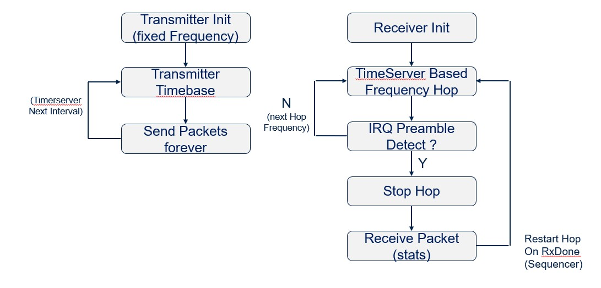
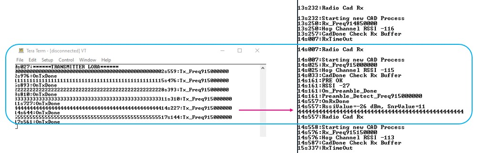
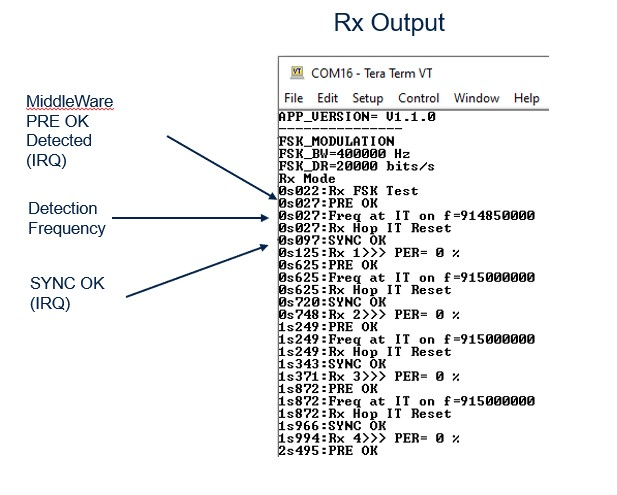
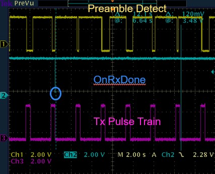
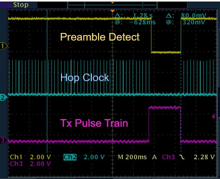

# STM32-Hotspot/STM32WL-SubGHz-Phy-Rx-Hop MCU Firmware Package, based on STM32CubeWL Release v1.2.0

## Example

This Hotspot FW package includes:
* Application example under "Projects\NUCLEO-WL55JC\Applications\SubGHz_Phy" called STM32WL-SubGHz-Phy-Rx-Hop.
* Includes three integrated projects, selectable by "define switches":

  [1] Channel Activity Detection (CAD) (applicable to LoRa only)

  [2] Preamble Detection for frequency hopped LoRa packet structures

  [3] Preamble Detection for frequency hopped FSK systems

* The projects demonstrates a transmitter device (implemented on a stand alone Nucleo-WL55JC MB1389 board) and a receiver (implemented on a second Nucleo-WL55JC MB1389 board) that can be configured as a standalone demodulator or a frequency hopping scanner and demodulator.  The project described within this document, will continue to be optimized and updated.
* The concept is presented in block diagram form:

The transmitter operates in stand alone mode and sends packets every TRANSMIT_PERIOD_MS.
The receiver frequency hops, over a predefined bandwidth, (FREQSTEP * HOP_MAX_NB_CHANNEL) at a rate of _RECEIVE_PERIOD_MS_.
The receiver hop rate is defined by the hop clock period.  When the receiver detects a preamble of length LORA_RX_PREAMBLE_LENGTH, the hop clock is stopped and the receiver is allowed to dwell and demodulate any LoRa signal which may be present at the stopped frequency.  The process repeats continuously and can be observed by enabling two Teraterm terminal outputs and also through the appropriate debug pins, described in subsequent sections of this file.

## Programming Features Demonstrated
* The project is developed through the use of the CubeMX tool to set up and initialize the project including the end user board configuration.  In this example, the end user board is the Nucleo board.
* CubeMX generates a standard project output where the user application code predominantly resides in the files subghz_phy_app.c and subghz_phy_app.h.
* Process and overall radio state control is implemented using the _Sequencer_ concept.  
* The _TimeServer_ is utilized to periodically trigger the transmitter to send packets every TRANSMIT_PERIOD_MS.  The receiver uses another instance of the timerserver, to implement the receiver hop rate defined by RECEIVE_PERIOD_MS.
* The TimeServer operates through the Real Time Clock (RTC) base and as such, can continue to function even when the STM32WL enters stop modes.

* Development tools, toolchains/compilers: IAR EWARM V9.20.1, STM32CubeIDE v1.9.0
   * Supported Devices and hardware boards: NUCLEO (MB1389) Rev C or Rev D
   * Supported Firmware Revisions: STM32CubeFirmware_FW_WL_V1.2.0 or STM32CubeFirmware_FW_WL_V1.1.0
   * Oscilloscope, useful for observing various test points, but not necessary
   * Known limitations: See below in separate section

## Boards Required

  * Two NUCLEO-WL55JC or NUCLEO-WL55JC1 (MB1389 RevC/RevD)
    * [NUCLEO-WB55JC](https://www.st.com/en/evaluation-tools/nucleo-wl55rg.html)

## General Information Regarding Project Structure
* The project is controlled through the use of several _#defines_ present within the project
* Both the sughz_phy_app.c and subghz_phy_app.h files contain important settings.
* These settings will be described during each of CAD, Preamble Detect (LoRa) and Preamble Detect (FSK) sections
* While the entire sughz_phy_app.c and subghz_phy_app.h essentially represents custom code, the user may search for all code modifications by searching for the key word _/* STM */_,
* This will highlight areas where code modifications have been implemented outside of the subghz files and related to the _**Known Limitations**_

## Channel Activity Detector (CAD)
### Overview
The Channel Activity Detector can be used to scan a RF Channel for the presence of a LoRa signal.  This is a flexible feature and allows the detection of packets containing a minimum of _one_ LoRa symbol.  Note that this does not include the preamble and is specific to the LoRa symbols in the payload.  This is accomplished through an internal correlator with parameters predefined according to the particular spreading factor used.
It is important to note that the CAD process is a separate and stand alone process.  It returns an IRQ result, whether or not a LoRa packet was detected.  As such, the CAD process output must be serviced every time it is invoked.

### How to Make It Work
* Select from the project folder provided, the tool chain of choice
* Begin with the Transmitter Set Up
   * Set the define approximately online 43 to _TRANSMITTER_
   * set the _#define USECAD  1_ and _#define USEPREAMBLE  0_
   * in file subghz_phy_app.h, ensure that the LoRa standard is selected _#define USE_MODEM_LORA  1_
   * Build the project and download into one of the Nucleo boards.
   * Enable a Terminal viewer such as Teraterm and set the parameters to Serial, 115200 baud, Receive Auto, Local Echo On
   * The transmitter output will appear on the terminal display window
* Repeat the same process for the receiver board with the define setting programmed to _RECEIVER_
* A properly operating project will show a screen output similar this.

### Notes Regarding This Example
The CAD Process implements two sequencer instances.  One to control the overall receive process and another to control the CAD process after a CAD IRQ has been detected.
The CAD process, when invoked, will generate a CAD IRQ, regardless of whether a valid LoRa packet was detected or not.  As previously mentioned, the IRQ callback needs to be serviced.  The CAD IRQ call back is implemented through function _the static void CadDone(bool channelActivityDetected)_.  In addition, the RadioEvent structure is modified to include the additional event, _(RadioEvents.CadDone = CadDone;_  Finally, as shown in the code, the CAD parameters must be set up and re-initialized each time prior to use.

With the base code in place, when a CAD call back is triggered, the sequencer process _static void CAD Process(void)_ is executed.  The only instruction within this function is to enable a Radio.RX(TImeOut).  If a signal exists, it will be demodulated, only if the Radio.Rx configuration parameters match.  If a signal does not exist, the TimeOut occurs and the radio receive sequencer/process is started again.  (At the time of this project, there is an internal investigation in place to examine why the radio does not enter receive mode automatically when a LoRa packet is detected).

### CAD With Frequency Hop:
It is possible to use the CAD Detect in frequency hop mode.  This will allow the receiver to scan a set of channels, dwell to determine if a valid LoRa packet exists and move onto another frequency if the receive time out occurs.
To implement this feature, it is necessary to uncomment the code approximatley at line 380 and 381 and to set the TimerServer hop parameters (RECEIVE_PERIOD_MS) appropriately to match the modulation and packet characteristic.

## Preamble Detect With a LoRa Signal in Frequency Hop Mode
In this section, the use of a custom frequency hop algorithm, using the TimeServer concept is implemented on a receiver platform.  The object is for the receiver to hop as quickly as possible, searching for the presence of a valid LoRa preamble.

Unlike the CAD detection, where all of the preamble symbols have to be processed in order to analyze the payload, the preamble detect described in this document, is examining only a short subset of the actual transmitter generated preamble.  This allows for fast hopping and detection of series of valid transmitters that may be present over a pre-defined bandwith.  If a preamble match is detected, the hop clock is stopped and the receiver is allowed to dwell and attempt to demodulate a signal that may be present at the frozen frequency.  The process is a continous process as demonstrated in this example.

### How to Make It Work
* Select from the project folder provided, the tool chain of choice
* Begin with the Transmitter Set Up
   * In file subhz_phy_app.c
   * Set the define approximately online 43 to _TRANSMITTER_
   * Set the _#define USECAD  0_ and _#define USEPREAMBLE  1_
   * Set the TRANSMIT_PERIOD_MS to 2500 (2.5 seconds) and RECEIVE_PERIOD_MS to 17
   * In file subghz_phy_app.h, ensure that the LoRa standard is selected _#define USE_MODEM_LORA  1_
   * Also in this file, verify that the LoRA_PREAMBLE_LENGTH is set to 32 (Tx) and that the LORA_RX_PREAMBLE_LENGTH  is set to 4 (Rx)
   * Build the project and download into one of the Nucleo boards.
   * Enable a Terminal viewer such as Teraterm and set the parameters to Serial, 115200 baud, Receive Auto, Local Echo On
   * The transmitter output will appear on the terminal display window
* Repeat the same process for the receiver board with the define setting programmed to _RECEIVER_
* A properly operating project will show a quckly moving output on the receive terminal screen, dwelling when a valid LoRa packet is detected. The receive Terminal window will appear as shown below.

### Notes Regarding This Example
The project requires the addition of a radio event,  _RadioEvents.OnPreambleDetect = OnPreambleDetect;_ and the addition of the preamble detect call back.  The call back is triggered when a preamble detect IRQ is generated by the SubGHz Radio. There are two main components operating in this scenario:

[1] The Hop Clock is implemented through the function, _static void ReceivePacket(void *context)_.  This function is called by the Time Server Object, which triggers a "one shot interval"determined by the parameter RECEIVE_PERIOD_MS.  The hop clock operates continuously and is only stopped when a valid preamble is detected.  This process is implemented as it much more flexible than implemented a Receive.Rx(TimeOut) due to the short time periods.  Note also, that in the code, the TimerServer period is dithered for maximum detection capability.  This ensures that the receiver and transmitter do not artificially become synchronized to each other leading to the possibility of missed packets and detection.

   * The function, _static void Rx_Process(void)_ is called by the sequencer and of special note in the process is that the receiver is placed in Receive_Rx(0) mode, which means, continuous repception for that specific time period.  If a Radio.Rx(TimeOut) were implemented, there would be a conflict between the hop clock and receive timeout operation.

[2] When a valid preamble is detected, the IRQ and hence radio event call back is serviced in _void OnPreambleDetect(void)_.  When this function is entered, the hop clock is immediately stopped and the Preamble Detect IRQ is disabled.  The radio is set to the frequency to be visited and allowed to receive.  Once reception is complete, the hop process begins all over again.

## Preamble Detect With a GFSK Signal in Frequency Hop Mode
This process operates in a similar manner to the LoRa frequency hop application.  The TimeServer, hop clock, sequencer, are all re-used including  preamble detect call back and RadioEvents.  It is only important to ensure the define settings are set appropriately.

The complete configuration for Generic FSK (GFSK) code is provided within the project.  The complete GFSK set up is provided as it offers several custom configuration possibilities.  Unlike the LoRa example application, the GFSK configuration offers a built in preamble detect as part of the receive process.  The parameter, RxConfig.fsk.PreambleMinDetect = RADIO_FSK_PREAMBLE_DETECTOR_08_BITS; can be set to detect 8 bits through to 32 bits of a GFSK preamble received signal.  Unlike the LoRa project, the FSK preamble detector is built in.

Operating in a mode Identical to the LoRa configuration, the preamble detect generates the Preamble Detect IRQ and RadioEvent which is then serviced in the OnPreambleDetect() function call.  The code within the above function reamins the same.

This feature is useful in that it allows a transmitter to generate a long preamble sequence, such that it can be scanned and received at very low SNR.  Identical to the LoRa approach, the concept here is to scan one or many possible transmitters, attempting to detect the preamble subset of this particular transmitter.  

### How to Make It Work
* Select from the project folder provided, the tool chain of choice
* Begin with the Transmitter Set Up
   * In file subhz_phy_app.c
   * Set the define approximately online 43 to _TRANSMITTER_
   * set the _#define USECAD  0_ and _#define USEPREAMBLE  1_
   * Set the TRANSMIT_PERIOD_MS to 2500 (2.5 seconds) and RECEIVE_PERIOD_MS to 17
   * In file subghz_phy_app.h, ensure that the FSK standard is selected _#define USE_MODEM_LORA  0_ and _USE_MODEM_FSK   1_
   * Also in this file, leave all FSK settings to their default
   * Build the project and download into one of the Nucleo boards.
   * Enable a Terminal viewer such as Teraterm and set the parameters to Serial, 115200 baud, Receive Auto, Local Echo On
   * The transmitter output will appear on the terminal display window
* Repeat the same process for the receiver board with the define setting programmed to _RECEIVER_
* A properly operating project will show a quckly moving output on the receive terminal screen, dwelling when a valid LoRa packet is detected.  The terminal window will appear as follows:

### Notes Regarding This Example
The operation of this example is identical to the LoRa preamble detect example.  The difference being that the GFSK modulation and paramters are used instead of the LoRa parameters.  The process and code operation remains identical.

## Debug Options
There are several debug options, many of which are enabled in the project provided.
From within the IDE, the user has the option to trace variables through Live Watch, or Watch Windows.
In addition, several hardware debug pins are enabled, allowing the connection of either a oscilloscope or logic analyzer as appropriate.

* Note that these settings are already in place.  However, when starting a new CubeMX project, or modifying an existing example, these settings may not be in place and therefore, it is necessary to insert them manually.

* The following is a summary of the pins and project settings that must be enabled to view the debug outputs.

### Project Settings
* in file radio_conf.h, add the following lines:
   * #define RWF_MW_LOG_ENABLE  (to enable terminal print out of the middleware state)
   * #define IRQ_RX_DBG (IRQ_PREAMBLE_DETECTED| IRQ_SYNCWORD_VALID|IRQ_HEADER_VALID|IRQ_CAD_DETECTED) (to enable CAD and Preamble debug outputs)

* in file sys_conf.h
   * #define DEBUGGER_ENABLED            1  (to enable debug capability)
   * #define PROBE_PINS_ENABLED          1  (to enable debug pins to show activity)
   * #define LOW_POWER_DISABLE           1  (to keep the device from going into low power modes and allow the debugger to remain connected.)

### Debug Pins
* With the above settings, the following information may be viewed on a digital oscilloscope or logic analyzer
   * SPI Busy on GPIO Pin PA12
   * SPINSS GPIO on Pin PA4
   * Rx state GPIO Pin BP12
   * RxDone GPIO Pin PB9  (ensure this matches with pin definition below if modified)

### Additional Debug Pins
* Within the project, the LED GPIO pins are driven to provide a visual feedback of when specific states are entered and in addition, to provide the "start" and "stop" mapping when a particular state is entered and completed.
* Within the project, the following pins can be used as monitor points and brought out to an oscilloscope for viewing and measurements.
* Transmit Board
   * Tx Pulse Width Nucleo Board Pin CN10-26, GPIO PB9, Green LED
* Receive Board
   * OnRxDone Nucleo Board Pin CN10-26, GPIO PB9, Green LED (same as above)  Measures time from Radio.Rx(0) to OnRxDone
   * OnPreambleDetect Nucleo Board Pin CN10-28, GPIO PB15, Blue LED (Measures time from Radio.Rx(0) to Preamble Detect
   * Receive Hop Clock, Nucleo Board Pin CN10-30, GPIO PB11, Red LED, (Measures the hop clock transition from set to reset)

### Sample Waveform Outputs as Captured on the Tx and Rx Nucleo boards.
* The above pin descriptions have been used to demonstrate the various debug options.

  [1]	Hop Clock and Tx Clock Sampling Effects
   *		As the Rx and Tx are not synchronized in time, a rolling effect will be evident.  This affects when the hop clock Rx window opens up relative to the position of the Tx preamble.  Thus, detection is degraded and the introduction of both a short preamble detect sequence and the time dithering of the hop clock, improves this situation.

 * [2] 	Ideal scenario, Hop Clock, Tx Pulse, Preamble Detect
    *		This figure shows the hop clock being stopped as the preamble detect IRQ triggers.  The position relative to the Tx pulse is shown.

## Additional Project Settings
In reference to the shortened Preamble Detect with frequency hopping within the LoRa standard, it is necessary to state that this is not a standard operating mode for this particular device.  The project demonstrates methods in which the device may be configured to provide this shortened preamble detect while hopping over several frequencies.  

Given this state, the following steps are necessary to invoke the Preamble IRQ and Preamble Radio Event:
* in file radio.c
   * Search for /* STM */
   * Add code in lines 1728 through to 1736
   * This will trigger the Preamble IRQ to report to Radio Events Structure

* in file radio.h
   * Approximately, line 120, search for /* STM */
   * Add new event to RadioEvents_t, (OnPreambleDetect)

* in file subghz_phy_app.c
   * Add two new events to the RadioEvents structure
   * Add the prototype definitions in code area /* USER CODE BEGIN PFP */
   * Insert the callbacks as previously described

## Known Limitations
[1] Preamble Detection Generation From CubeMX
* As described above, the present CubeMX V6.5 and the versions of CubeFW release 1.2 and 1.1. do not provide the preamble detection and IRQ set up when generating a SubGHz project.  At the time of writing this article, the addition of these code features were being examined.  When generating a project via CubeMX, the user should verify the project settings described in "Additional Project Settings" are in place.  Note also, that because this is custom code, the modifications must be re-inserted each time a new CubeMX modification is implemented.  It is therefore useful to have a backup code copy where the modifications can easily be copy and pasted, where required.

[2] CubeFW Version 1.2 Vs 1.1
* During evaluation of the project code with both versions of firmware, it has been shown, for this particular application, that FW V 1.1 operates much more effectively.  Bug fixes within V 1.2 has slightly affected detection performance for LoRa with fast frequency hop and short preambles.  There is a work around implemented within this project however the user may modify the project code to suit the specific application.

## Theory Of Operation
While it is unconventional to place the theory of operation at the end of the document, the explanation here will help the user to understand how to set up and modify the project for custom applications.
* Optimum Hop Clock Settings
   * The optimum hop clock setting is 32 mS, with 4 symbol preamble detection
   * this can be reduced to 17 mS.  With a spreading factor, SF = 9, each symbol is approximately 4 mS in length.  Thus, 17 ms, represents a window of 4 symbols (16 mS) + 1 (mS) to ensure that 4 preamble symbols are captured within the preamble detect correlator.

* Other Hop Clock Settings;
   * It is possible to reduce the hop clock and to reduce the number of preamble symbols to be detected
   * for example, 3 preamble symbols and a hop clock rate of 10 mS, is a valid setting that allows the three preamble symbols to fit within the hop clock window
   * the side effect from this setting however is that the probability of incorrect frequency detection increases.
   * What this means, is that probability of settling on the desired channel +/- one channel increases.
   * the reason for this is that the correlator requires a minimum amount of time to process the received preamble sequence.  This computational time, is greater than the hop clock rate and therefore, the hop clock operates at rate that is faster than the minimum required computation time.
   * within the project code, in the OnPreambleDetect Callback, the frequency transition related to "from" and "to" are provided as debug outputs.  The user may implement a straight forward algorithm" based upon RSSI readings to allow the frequency to be set to that which provided the greater RSSI reading.  In practice and testing, this is the most likely correct frequency.  This scheme can be performed as the switching time of the RF Frequency Synthesizer is less than 15o uS.

## Troubleshooting

**Caution** : Issues and the pull-requests are **not supported** to submit problems or suggestions related to the software delivered in this repository. The STM32WL-SubGHz-Phy-Rx-Hop example is being delivered as-is, and not necessarily supported by ST.

**For any other question** related to the product, the hardware performance or characteristics, the tools, the environment, you can submit it to the **ST Community** on the STM32 MCUs related [page](https://community.st.com/s/topic/0TO0X000000BSqSWAW/stm32-mcus).
